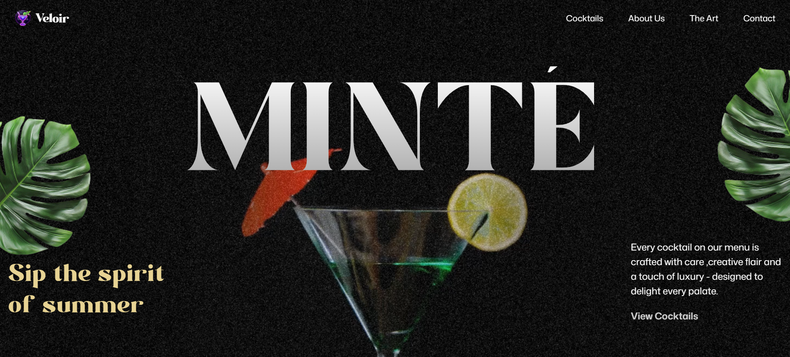

<h1 align="center">✨ Veloir — Premium Cocktail UI with Smooth GSAP Animations 🍸</h1>

  

  <em>A sleek, elegant, and modern cocktail-themed UI featuring luxurious GSAP animations and smooth text transitions.</em>

## 🚀 Live Demo

🌐 **[Click here to explore Veloir](https://veloir-delta.vercel.app/)**

---

## ✨ Features

- ✨ **GSAP-powered SplitText animations**
- 🍸 **Luxurious and modern cocktail-themed UI**
- 🧊 **Smooth fade, slide, and reveal effects**
- 💨 **Scroll-based and timeline-based animations**
- 🎨 **Stylish gradients and clean visual hierarchy**
- 📱 **Fully responsive and mobile-friendly**
- ⚡ **Built with Vite for blazing-fast performance**

---

## 🧰 Tech Stack

- **React.js** – Component-based UI  
- **Vite** – Fast development environment  
- **Tailwind CSS** – Utility-first styling  
- **GSAP** – High-performance animations  
- **SplitText Plugin** – Character/word-level text split animations  

---

## 🗂️ Folder Structure
<pre>
VELOIR/
├── constants/
│   └── index.js              # Centralized constants / data
├── node_modules/             # Dependencies
├── public/
│   ├── fonts/                # Custom font files
│   ├── images/               # Project images
│   └── videos/               # Video assets (if any)
├── src/
│   ├── components/
│   │   ├── About.jsx         # About section component
│   │   ├── Art.jsx           # Decorative / Art section
│   │   ├── Cocktails.jsx     # Cocktails display section
│   │   ├── Contact.jsx       # Contact section
│   │   ├── Hero.jsx          # Hero section with GSAP animations
│   │   └── Navbar.jsx        # Navigation bar
│   ├── App.jsx               # Main App component
│   ├── index.css             # Global Tailwind & styles
│   └── main.jsx              # Vite + React entry point
├── index.html                # Root HTML file
├── package.json              # Dependencies & scripts
├── package-lock.json         # Lock file
├── vite.config.js            # Vite configuration
└── README.md                 # Project documentation
</pre>

---

## 📩 Contact

📧 Email: **[maneabhishek2003@gmail.com](mailto:maneabhishek2003@gmail.com)**

🔗 Socials:  
**[LinkedIn](https://www.linkedin.com/in/abhishek-mane-9491422b8)** | **[GitHub](https://github.com/AbhishekMane06)**

---
